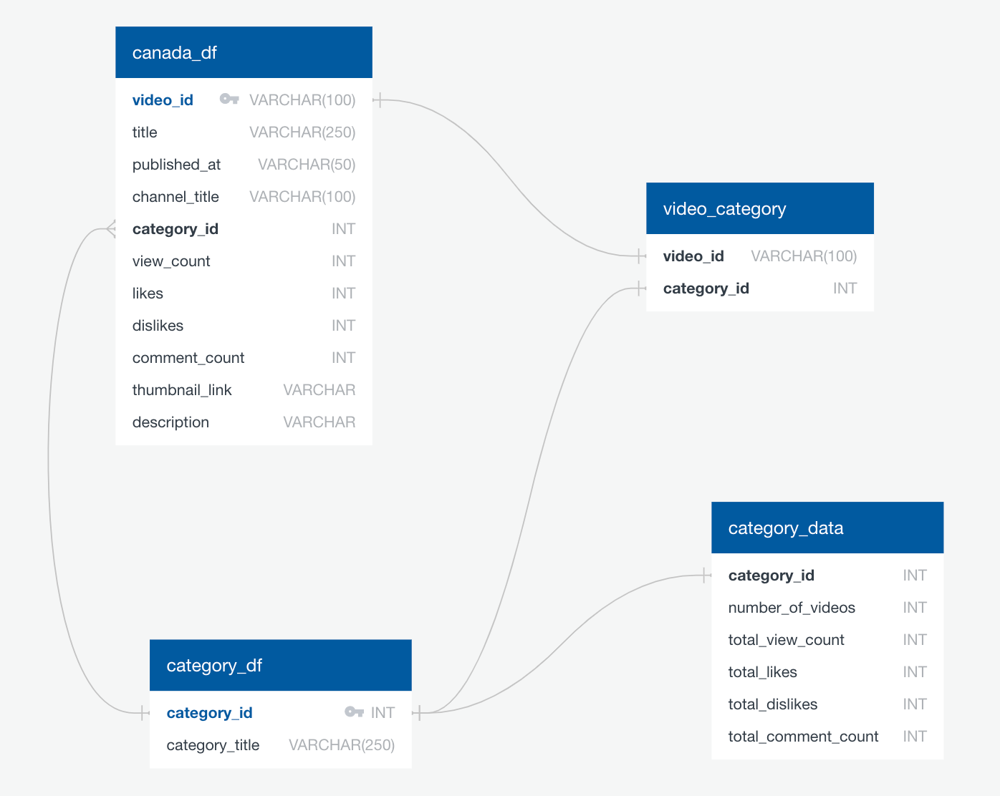

# ETL-project

Team members:
- Fariha Siddiqui
- Ying Feng

For this ETL project, we’ve used the trending youtube video statistics dataset from kaggle that provide daily statistics for the top trending videos on Youtube. The data was used to determine the top trending videos on the platform during the pandemic period. We noticed that the data provided in kaggle do not allow for category analysis as the information is provided in two separate sources. Therefore, we wanted to extract, transform and load these data in a way that allows for some kind of relational analysis. 

The potential use of the data is to identify  

- The categories of videos Canadians prefer to watch during the pandemic
- The factors that affect the popularity of certain videos
- Advertisement strategies that could be utilized by Youtube to promote material and generate revenues
- Provide insights to video makers on what type of videos to make during this period

The ERD diagram below shows the relationship between the tables stored in the database. 

